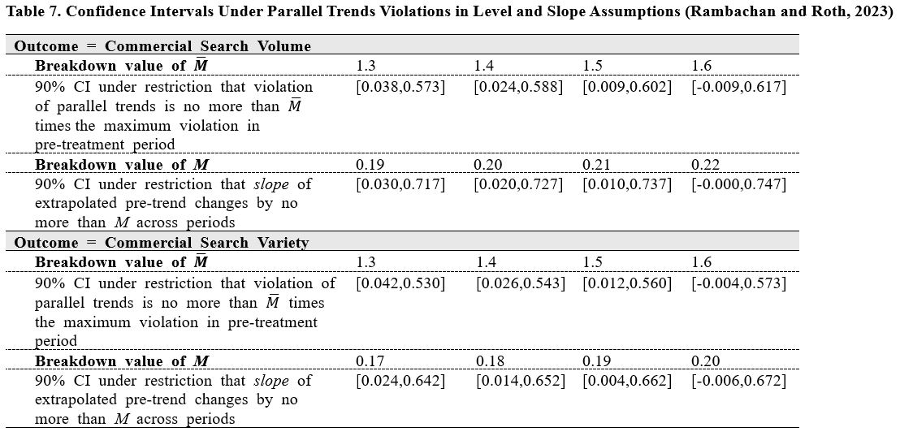

# Rambachan and Roth (2023)
## Key Parameters
* The first parameter, M bar, sets an upper bound on the extent to which the levels of the treated and control groups can differ in the post-treatment period. In essence, the analyst assumes that any deviation from parallel trends in the post-treatment period is at most M̄ times the largest deviation observed in the pre-treatment period. 
* The second parameter, M, captures violations in trend by constraining the difference in growth rates (i.e., slopes) between the treated and control groups. For example, if both groups grow at the same rate (e.g., 10% per period), the difference between them remains constant, satisfying the parallel trends assumption (M = 0). However, if the treated group grows at a faster rate (e.g., 15%) while the control group remains at 10%, the trends diverge. In this context, M quantifies the allowable deviation in growth rate differences. 

## Procedure
The authors provide a Stata package, [HonestDiD](https://github.com/mcaceresb/stata-honestdid), available on GitHub, for implementing this sensitivity analysis

## What to look for
The breakdown values for M bar and M provide insight into how robust the main estimates are to violations in parallel trend. A common benchmark to compare breakdown values for M is standard errors of treatment effect estimates (Arold 2024). Breakdown values of significant size relative to standard errors of the treatment effect estimates indicate that the estimated effects remain statistically significant even when allowing for trend violations far exceeding typical sampling variation.
