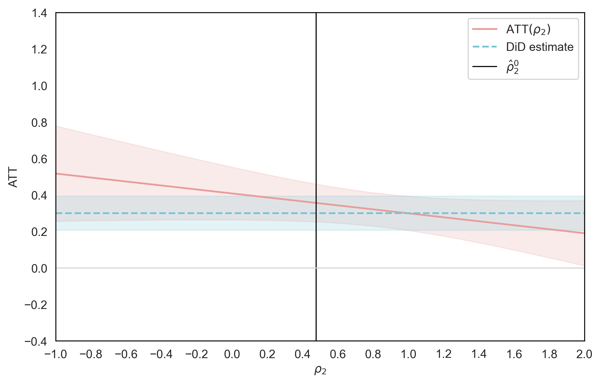

# Ghanem et al. (2022)
## Key Parameter
ρ_2 captures the extent to which time-varying unobservables differently affect treated and control groups. When ρ_2=1, the unobservables have no differential impact, thus satisfying the standard parallel trends assumption. Deviations from unity (ρ_2≠1) signal potential violations. 

## Procedure
### Stata Code
```stata
/******************************************************************************
Variable Definition

lead_lag: number of weeks before or after treatment event 
id: user id
tg: treatment_i
inter: treatment_it 
dv: dependent variable
week: week
******************************************************************************/

local rho2 = 1 // set value of rho2
local pre_cutoff -9 // Cutoff point dividing early and late pre-treatment

*--------------------------------------------------------------
* Estimate ATT(ρ₂) and confidence intervals
*--------------------------------------------------------------
use "data.dta", clear
reghdfe dv inter, absorb(id week) cluster(id)
local DiD = _b[inter] 

gen time = 0 // earliest pre-treatment period
replace time = 1 if lead_lag >= `pre_cutoff' & lead_lag < 0 // late pre-treatment period
replace time = 2 if lead_lag >= 0 // post-treatment period
collapse (mean) dv, by(id tg time)
keep if time==1 | time==2
reshape wide dv, i(id) j(time)
gen deltaY = dv2 - dv1

qui su tg, meanonly
local p = r(mean)
qui su deltaY if tg==1, meanonly
local theta_delta0_treated = r(mean)
qui su dv1 if tg==1, meanonly
local theta10_treated = r(mean)
qui su deltaY if tg==0, meanonly
local theta_delta0_control = r(mean)
qui su dv1 if tg==0, meanonly
local theta10_control = r(mean)

display "Proportion Treated (p)            = " %6.3f `p'
display "Treated mean of ΔY (theta_delta0) = " %6.3f `theta_delta0_treated'
display "Control mean of ΔY                = " %6.3f `theta_delta0_control'
display "Treated mean of Y1 (theta10)      = " %6.3f `theta10_treated'
display "Control mean of Y1                = " %6.3f `theta10_control'

local selection_bias = `theta10_treated' - `theta10_control'
local ATT_rho2 = `DiD' - (`rho2' - 1)*(`selection_bias')

gen psi = (tg/`p')*(deltaY - `theta_delta0_treated') - ((1-tg)/(1-`p'))*(deltaY - `theta_delta0_treated') ///
          - (`rho2' - 1)*((tg/`p')*(dv1 - `theta10_treated') - ((1-tg)/(1-`p'))*(dv1 - `theta10_treated'))

gen psisq = psi^2
qui su psisq, meanonly
local V = r(mean)
local n = _N

local se = sqrt(`V'/`n')
display "DiD estimate (from ΔY)                = " %6.4f `DiD'
display "Selection Bias (Y1: treated - control)  = " %6.4f `selection_bias'
display "ATT(ρ₂) estimate                      = " %6.4f `ATT_rho2'

display "Estimated asymptotic variance (V)    = " %6.4f `V'
display "Sample size (n)                      = " `n'
display "Standard error of ATT(ρ₂)              = " %6.4f `se'

*--------------------------------------------------------------
* Estimate benchmark ρ1
*--------------------------------------------------------------
use "data.dta", clear
gen time = 0 // earliest pre-treatment period
replace time = 1 if lead_lag >= `pre_cutoff' & lead_lag < 0 // late pre-treatment period  
replace time = 2 if lead_lag >= 0 // post-treatment period
collapse (mean) dv, by(id tg time)
keep if time == 0 | time == 1 // Keep only pre-treatment data
bysort id (time): egen mean_Y = mean(dv) 
gen Y_demeaned = dv - mean_Y
drop dv
reshape wide Y_demeaned, i(id) j(time)
reg Y_demeaned1 Y_demeaned0, nocons // Estimate ρ1

display "Estimated ρ1 = " _b[Y_demeaned0]

*--------------------------------------------------------------
* Estimate benchmark ρ_2^0
*--------------------------------------------------------------
use "data.dta", clear
gen time = 0 // earliest pre-treatment period
replace time = 1 if lead_lag >= `pre_cutoff' & lead_lag < 0 // late pre-treatment period
replace time = 2 if lead_lag >= 0 // post-treatment period
keep if tg == 0 // Keep only control group data
keep if time == 1 | time == 2  
bysort time (id): egen mean_Y_control = mean(dv)
gen Y_tilde = dv - mean_Y_control
keep Y_tilde id time
duplicates drop id time, force
reshape wide Y_tilde, i(id) j(time)
reg Y_tilde2 Y_tilde1, nocons // Estimate ρ_2^0

display "Estimated ρ_2^0 = " _b[Y_tilde1]
```

### Code for Visualization (Python)
```python
import numpy as np
import matplotlib.pyplot as plt
import seaborn as sns

# Replace these with your actual data for rho2_values, ATT_values, original_did, ATT_standard_errors, and original_standard_errors
rho2_values = np.array([-1,-0.9,-0.8,-0.7,-0.6,-0.5,-0.4,-0.3,-0.2,-0.1,0,0.1,0.2,0.3,0.4,0.5,0.6,0.7,0.8,
0.9,1,1.1,1.2,1.3,1.4,1.5,1.6,1.7,1.8,1.9,2])
ATT_values = np.array([0.5172,0.5063,0.4954,0.4845,0.4736,0.4627,0.4518,0.4409,0.4300,0.4191,
                       0.4082,0.3973,0.3864,0.3755,0.3646,0.3537,0.3428,0.3319,0.3210,0.3102,
                       0.2993,0.2884,0.2775,0.2666,0.2557,0.2448,0.2339,0.2230,0.2121,0.2012,0.1903])
original_did = np.full_like(rho2_values,0.2993)

ATT_standard_errors = np.array([0.1332,0.1269,0.1206,0.1144,0.1083,0.1022,0.0962,0.0904,0.0846,0.0791,
                                0.0737,0.0686,0.0638,0.0593,0.0554,0.0520,0.0494,0.0476,0.0466,0.0467,
                                0.0477,0.0497,0.0524,0.0559,0.0599,0.0644,0.0692,0.0744,0.0798,0.0854,0.0911])
original_standard_errors = np.full_like(rho2_values,0.0477)

# Confidence intervals for ATT(ρ₂)
ATT_upper = ATT_values + 1.96 * ATT_standard_errors
ATT_lower = ATT_values - 1.96 * ATT_standard_errors

# Original confidence intervals
original_upper = original_did + 1.96 * original_standard_errors
original_lower = original_did - 1.96 * original_standard_errors

plt.figure(figsize=(8, 5))
sns.set_style("whitegrid")

# Plot ATT(ρ₂) with confidence intervals
plt.plot(rho2_values, ATT_values, color='#e69e9c', label=r'ATT$(\rho_2)$')
plt.fill_between(rho2_values, ATT_lower, ATT_upper, color='#e69e9c', alpha=0.2)

# Plot original DiD estimates with confidence intervals (red shaded region)
plt.plot(rho2_values, original_did, color='#78c4d4', linestyle="dashed", label="DiD estimate")
plt.fill_between(rho2_values, original_lower, original_upper, color='#78c4d4', alpha=0.2)

# Vertical lines for benchmark values
plt.axvline(x=.47768521, color="black", linestyle="-", linewidth=0.9, label=r'$\hat{\rho}_2^0$')
plt.axhline(y=0, color="lightgray", linestyle="-", linewidth=0.9)
plt.ylim(-0.4,1.4)
plt.xlim(-1,2)
plt.yticks(np.arange(-0.4,1.5,0.2))
plt.xticks(np.arange(-1,2.1,0.2))
plt.grid(False)

for spine in plt.gca().spines.values():
    spine.set_edgecolor('black')
plt.xlabel(r'$\rho_2$')
plt.ylabel('ATT')
plt.legend()

plt.savefig('plot.png', dpi=300, bbox_inches='tight')
plt.show()
```

## What to look for
* Examine whether ATT(ρ_2) remains significant and the confidence interval includes the original DiD estimate even under relatively high departures from ρ_2=1. 
* Examine whether ATT(ρ_2) remains significant and the confidence interval includes the original DiD estimate when ρ_2 is set to benchmark values such as ρ_2^0, which represents the threshold value at which the average treatment effect would be nullified.
