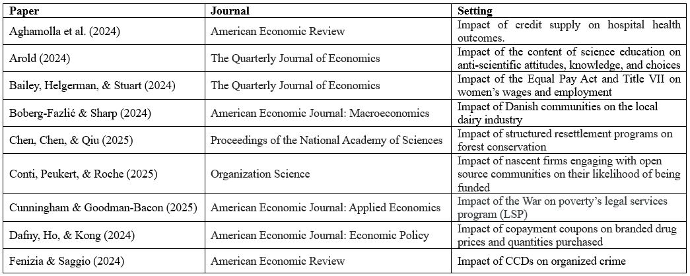
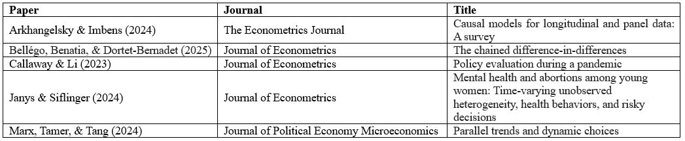

# Practitioner's Guide to DiD Robustness Checks
This repository offers a curated set of robustness checks—with code and documentation—for validating key assumptions in difference-in-differences (DiD) designs, especially the parallel trends assumption. It draws from a thorough review of recent econometric advances, most notably:
* Roth, Jonathan, et al. (2023). “What’s Trending in Difference-in-Differences? A Synthesis of the Recent Econometrics Literature.” Journal of Econometrics, 235(2), 2218–2244.
* Baker, Andrew, et al. (2025). “Difference-in-Differences Designs: A Practitioner's Guide.” arXiv preprint arXiv:2503.13323.
Each folder in this repository contains code, references to the relevant papers, and notes explaining how the method works in practice.

## Robustness Checks Implemented
👉 Click on any method below to navigate directly to the corresponding folder containing code and materials:

1. **[Event Study Plots](./01_event_study/)**
2. **[Simulated Placebo Tests](./02_placebo_test/)**
3. **[Rambachan & Roth (2023) Sensitivity Analysis](./03_rambachan_roth_2023/)**
* Studies that applied Rambachan and Roth (2023) to show robustness of their DiD estimates

4. **[Ghanem, Sant'Anna & Wüthrich (2022) Sensitivity Analysis](./04_ghanem_et_al_2022/)**
* Studies citing Ghanem, Sant'Anna & Wüthrich (2022)

5. **[Unit-Specific Trends](./05_unit_specific_trends/)**
6. **[Instrumental Variables](./06_instrumental_variables/)**
7. **[Heterogeneity-Robust Estimators](./07_heterogeneity_robust_estimators/)**

## References
- Baker, A., et al. (2025). Difference-in-differences designs: A practitioner's guide. arXiv preprint arXiv:2503.13323.
- Domencich, T. A., & McFadden, D. (1975). Urban travel demand: A behavioral analysis (Monograph, 1975).
- Freyaldenhoven, S., Hansen, C., & Shapiro, J. M. (2019). Pre-event trends in the panel event-study design. American Economic Review, 109(9), 3307–3338.
- Ghanem, D., Sant’Anna, P. H. C., & Wüthrich, K. (2022). Selection and parallel trends. arXiv preprint arXiv:2203.09001.
- Goodman-Bacon, A. (2021). Difference-in-differences with variation in treatment timing. Journal of Econometrics, 225(2), 254–277.
- Helpman, E., Melitz, M., & Rubinstein, Y. (2008). Estimating trade flows: Trading partners and trading volumes. The Quarterly Journal of Economics, 123(2), 441–487.
- Lee, S. J., & Wooldridge, J. M. (2023). A simple transformation approach to difference-in-differences estimation for panel data. SSRN Working Paper No. 4516518. https://doi.org/10.2139/ssrn.4516518
- McFadden, D. (1979). Quantitative methods for analyzing travel behavior of individuals: Some recent developments. In D. Hensher & P. Stopher (Eds.), Behavioral travel modelling (Chapter 15, pp. 306–[end page]). Croom Helm.
- Mora, R., & Reggio, I. (2019). Alternative diff-in-diffs estimators with several pretreatment periods. Econometric Reviews, 38(5), 465–486.
- Rambachan, A., & Roth, J. (2023). A more credible approach to parallel trends. Review of Economic Studies, 90(5), 2555–2591.

## Citation
```bibtex
@misc{did-robustness,
  author = {Juwon Hong},
  title = {Practitioner’s Guide to DiD Robustness Checks},
  year = {2025},
  url = {https://github.com/jean-jsj/did-robustness}
}
```
